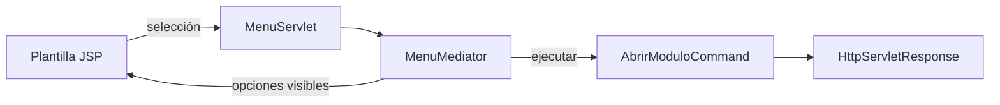
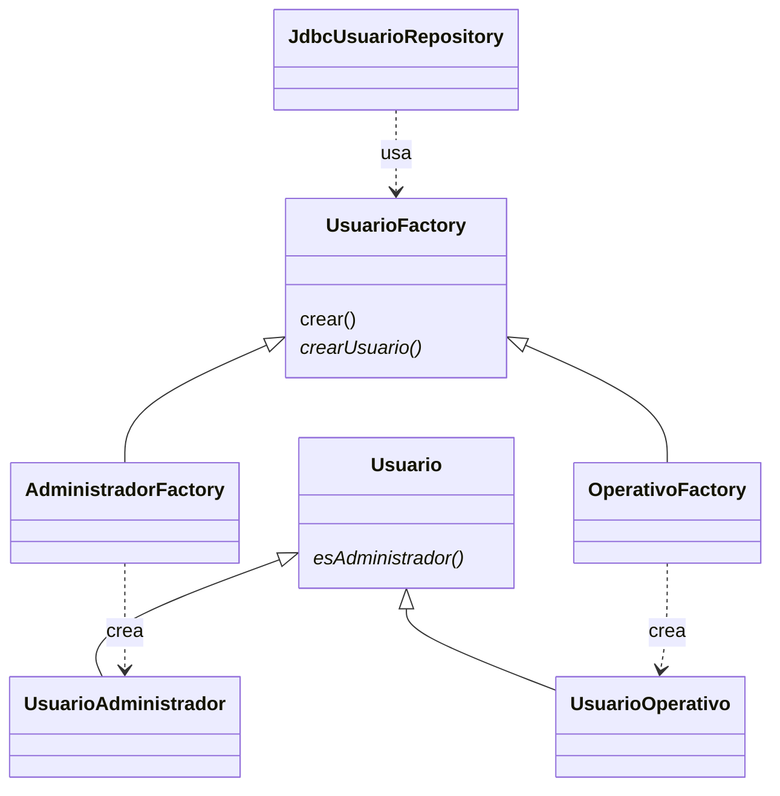

# Patrones de NovaTech: explicación por bloques

Referencia: `Estructura!B2,I5:I7` del Excel. Se seleccionan dos patrones de cada lista para los módulos desarrollados. No se agregan Observer, Memento ni otros para aumentar artificialmente el número.

## Login: Singleton y Facade

**Singleton.** `ConexionBD` tiene constructor privado y una clase interna que conserva la única instancia. `getInstancia()` devuelve ese gestor. `obtenerConexion()` abre conexiones independientes que cada operación cierra. Una instancia del gestor no significa compartir una Connection JDBC entre todas las peticiones.

**Facade.** `AppServlet` llama a `AccesoFacade.intentar(usuario,password)`. La fachada valida la entrada y oculta la llamada al repositorio de autenticación; devuelve un `ResultadoAcceso` que el controlador convierte en redirección o aviso. La verificación del hash y la transacción del contador quedan en el modelo. No es una fachada que reemplace toda la seguridad.

El filtro controla el acceso antes de los servlets. Puede describirse como protección de acceso, pero no es necesario contarlo como un Proxy GoF estricto para alcanzar el mínimo.

## Menú: Command y Mediator

1. `ComandoMenu` es el contrato de una opción: clave, título, ruta, disponibilidad y ejecución.
2. `AbrirModuloCommand` encapsula una navegación concreta. El receptor de la operación es `HttpServletResponse`, que realiza la redirección a una ruta constante.
3. `MenuMediator` registra las opciones, coordina cuáles muestra la vista según los permisos y resuelve una selección. La vista y el servlet delegan estas decisiones al coordinador.
4. `pagina.jsp` presenta las opciones obtenidas del mediador. Un clic va a `/abrir?opcion=...`.
5. `MenuServlet` entrega la selección al mediador, que verifica disponibilidad y ejecuta el comando. Una selección desconocida devuelve 404; una no autorizada, 403.
6. `SeguridadFilter` también protege la URL final: ocultar enlaces por sí solo no autoriza ni protege una acción.



Esta es una aplicación pequeña de Mediator: coordina la presentación, selección y ejecución del menú; no es un bus de eventos ni un sistema distribuido.

## Usuarios: Repository y Factory Method

**Repository.** `UsuarioRepository` define el contrato; `JdbcUsuarioRepository` concentra consultas, mapeo y transacciones. Los controladores solicitan operaciones, y las JSP presentan objetos sin ejecutar SQL. El análisis detallado está en `docs/etapa4/01-Analisis-Repository.md`.

**Factory Method.** La fábrica anterior era estática y simple. Ahora:

| Participante | Código | Responsabilidad |
|---|---|---|
| Producto abstracto | `Usuario` | Datos comunes y contrato `esAdministrador()` |
| Productos concretos | `UsuarioAdministrador`, `UsuarioOperativo` | Identifican el perfil base; no reemplazan los permisos consultados en BD |
| Creador abstracto | `UsuarioFactory` | Declara `crearUsuario()` y usa ese método desde `crear()` |
| Creadores concretos | `AdministradorFactory`, `OperativoFactory` | Sobrescriben el método fábrica y deciden el producto |
| Consumidor real | `JdbcUsuarioRepository.map` | Elige el creador con el rol leído de la BD, crea el producto y completa sus datos |

```java
// UsuarioFactory: operación común que utiliza el método sobrescrito.
protected abstract Usuario crearUsuario();
public final Usuario crear() {
    Usuario u = crearUsuario();
    u.username = ""; u.nombres = ""; u.apellidos = ""; u.activo = true;
    return u;
}
```

`paraRol()` es una selección estática del creador; el Factory Method propiamente dicho es `crearUsuario()`, sobrescrito por las subclases. El rol se toma de la base, no se confía en un parámetro del login. Los permisos se recargan en cada petición y pueden variar para un perfil operativo.



## Demostración de cinco minutos

1. Mostrar el login y el código del gestor Singleton; explicar por qué las conexiones se cierran.
2. Abrir usuarios desde la barra lateral y seguir JSP → MenuServlet → Mediator → Command.
3. Crear y editar una cuenta de prueba. Seguir controlador → Repository → transacción → MySQL.
4. Mostrar `map()` y los dos creadores: el tipo de objeto depende del rol almacenado.
5. Registrar un correo y una dirección de esa cuenta; explicar las claves foráneas del modelo.
6. En un rol temporal, asignar y retirar un permiso. Mostrar que no basta con escribir la URL para entrar.

El proyecto conserva Java, JSP, JDBC y MySQL. Las clases añadidas corresponden a los patrones y relaciones del Excel, sin incorporar frameworks adicionales.
