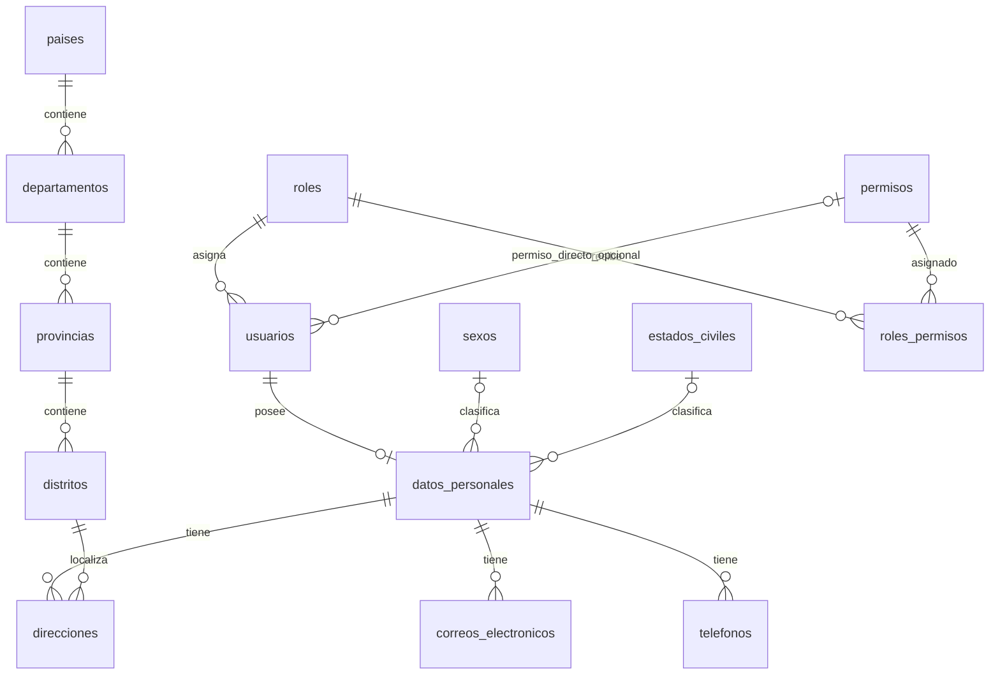

# Modelo de datos de NovaTech y análisis hasta 3FN

Fuentes: `M3!B4:F120` y `Estructura!J3:J4` del Excel. Esquema implementado: `database/esquema.sql` seguido de `database/etapa3-ampliar-estructura.sql`. No se afirma implementar 4FN, 5FN o 6FN por tener muchas tablas.

## Diagrama de relaciones actual

El esquema permite un usuario sin ficha personal; los formularios guardan usuario y ficha juntos en una transacción. `datos_personales.id_usuario` es único y no nulo. Cada usuario tiene un rol obligatorio; un rol puede tener varios permisos y un permiso pertenecer a varios roles.

## Claves y dependencias

| Relación | Clave primaria | Otras claves/restricciones | Dependencia funcional principal |
|---|---|---|---|
| usuarios | id_usuario | nombre_usuario UNIQUE; id_rol FK; id_permiso FK opcional | id_usuario → nombre_usuario, hash, rol, permiso directo, estado, controles y auditoría |
| datos_personales | id_datos_personales | id_usuario UNIQUE FK; DNI UNIQUE si informado; sexo y estado civil FK opcionales | id_datos_personales → usuario, nombres, apellidos, DNI, sexo, estado civil y auditoría |
| roles | id_rol | nombre UNIQUE | id_rol → nombre, descripción, estado y auditoría |
| permisos | id_permiso | nombre UNIQUE | id_permiso → nombre, descripción, estado y auditoría |
| roles_permisos | (id_rol, id_permiso) | Ambas columnas FK | pareja → estado y auditoría de la asignación |
| sexos | id_sexo | descripción UNIQUE | id_sexo → descripción, estado y auditoría |
| estados_civiles | id_estado_civil | descripción UNIQUE | id_estado_civil → descripción, estado y auditoría |
| correos_electronicos | id_correo | UNIQUE(persona, correo); persona FK | id_correo → persona, correo, tipo, estado y auditoría |
| telefonos | id_telefono | UNIQUE(persona, número); persona FK | id_telefono → persona, número, tipo, estado y auditoría |
| direcciones | id_direccion | Persona y distrito FK | id_direccion → persona, distrito, calle, número, piso, tipo, referencia, estado y auditoría |
| paises | id_pais | nombre UNIQUE | id_pais → nombre, estado y auditoría |
| departamentos | id_departamento | UNIQUE(país, nombre); país FK | id_departamento → país, nombre, estado y auditoría |
| provincias | id_provincia | UNIQUE(departamento, nombre); departamento FK | id_provincia → departamento, nombre, estado y auditoría |
| distritos | id_distrito | UNIQUE(provincia, nombre); provincia FK | id_distrito → provincia, nombre, estado y auditoría |

`usuario_registro` conserva el nombre del actor como dato histórico opcional, no una copia de todos sus datos. La fecha de nacimiento y los campos de recuperación son opcionales heredados; no se presentan como funcionalidades terminadas.

## Primera forma normal

Cada columna almacena un valor del dominio y cada fila tiene clave. No se guardan varios teléfonos o correos separados por comas en usuarios. Cada contacto es una fila. Nombres y apellidos se tratan como valores del dominio personal; no se pretende separar cada palabra en otra tabla.

## Segunda forma normal

Los atributos no clave dependen de la clave completa. En `roles_permisos`, los datos de la asignación corresponden a la pareja rol–permiso; no se repite el nombre del rol ni la descripción del permiso. En los catálogos territoriales, el nombre es único dentro del padre, no globalmente para todos los países.

Tener una clave artificial de una columna no demuestra por sí solo la normalización: también se consideran las claves alternativas indicadas en la tabla y las reglas de negocio.

## Tercera forma normal

Para las dependencias del modelo anterior, no se almacenan atributos descriptivos de otra entidad en la fila que la referencia:

- Usuarios guarda `id_rol`, pero el nombre y descripción del rol se obtienen de `roles`.
- Datos personales guarda las claves de sexo y estado civil, pero sus descripciones están en catálogos.
- Dirección guarda el distrito; provincia, departamento y país se obtienen recorriendo las relaciones. No se duplican sus nombres en la dirección.
- El correo y teléfono dependen de su contacto/persona; no almacenan el nombre del usuario ni del rol.
- Los permisos del rol se representan mediante filas en `roles_permisos`; el permiso directo opcional del usuario es una concesión independiente, no una copia del permiso de su rol.

Ejemplo: al corregir el nombre de una provincia, se actualiza una fila de `provincias`; todas las direcciones la muestran mediante su distrito. No hay que corregir cada domicilio.

La conclusión de 3FN se limita a estas reglas y dependencias; cambiar reglas, por ejemplo exigir un correo globalmente único, obliga a revisar restricciones y análisis. Más tablas no equivalen automáticamente a mayor forma normal.

## Integridad y operación

- Usuario y datos personales se guardan en una transacción. El borrado elimina su ficha y los contactos dependientes.
- Correos y teléfonos no pueden duplicarse dentro de la misma persona.
- No puede borrarse una ubicación referenciada por otra ubicación o una dirección.
- Los formularios ofrecen distritos cuya cadena territorial está activa.
- La actualización de permisos del rol es transaccional; se revisa la autorización en el servidor.
- Los datos de auditoría actuales no conservan todas las versiones de una fila. La bitácora completa queda como requisito pendiente del proyecto final.

## Diferencias deliberadas frente a ejemplos

IDs INT autoincrementales en vez de códigos de ejemplo como P01; nombres SQL en snake_case; booleano para activo/inactivo; longitudes ampliadas en algunas descripciones; hash de contraseña en vez de cifrado reversible. La relación de contactos permite varios por persona según M3. No se fusionan todos los modelos alternativos de las otras hojas.
