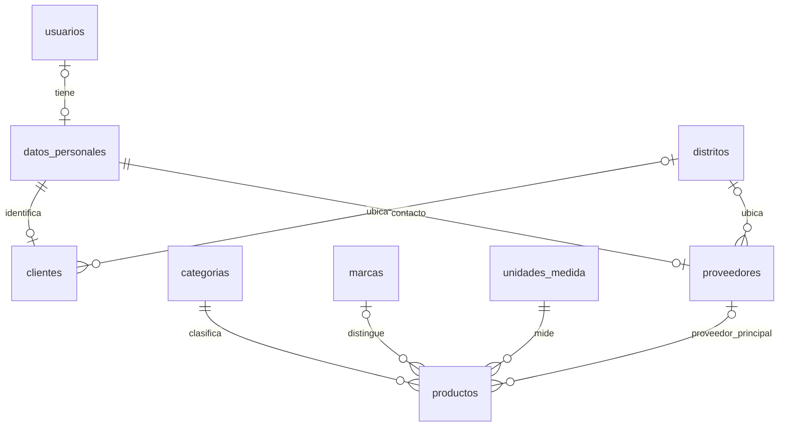

# Etapa 5: clientes, proveedores y artículos

Implementación local: 7 de octubre de 2026. Cierre de correcciones y regresión local: 8 de octubre de 2026. Pendiente, con autorización expresa: migración en Aiven, publicación y comprobación en Render.

Las referencias oficiales de este alcance son exclusivamente los dos Excel de POO II entregados por el alumno y sus instrucciones. El PDF de Gerenciamiento de Datos I no define requisitos de NovaTech.

## Correspondencia con el Excel

Fuente: `13.1 Etapas del desarrollo de la solución informática.xlsx`, hoja Etapas, D22:D24 y D27 (semana 9). El enlace de D12 corresponde al segundo Excel ya proporcionado, según aclaración del alumno; no es otro documento pendiente.

| Requisito | Entrega | Evidencia |
| --- | --- | --- |
| Crear/reorganizar tablas | `database/etapa5-comercial.sql` | Ejecutada dos veces en MySQL local aislado; conservó usuarios y fichas existentes |
| Registrar datos | Formularios, importación de proveedores y fixture de demostración | Registros ficticios insertados, consultados, editados y eliminados durante QA |
| CRUD clientes | `/clientes`, ClienteRepository y JDBC | DNI o RUC, contacto principal, distrito, activo/inactivo, búsqueda y eliminación |
| CRUD proveedores | `/proveedores`, ProveedorRepository y JDBC | RUC, razón social, contacto y ubicación; importación TSV transaccional |
| CRUD mercadería/productos/insumos/servicios | `/productos`, ProductoRepository y JDBC | Código, tipo, categoría, marca, unidad, proveedor principal, precio y stock |
| Análisis por bloques de Repository | `02-Analisis-Repository.md` | Contratos, implementaciones, transacciones, vistas y flujo HTTP |
| Dos patrones por módulo, Estructura!B2 e I8:I10 | Clientes: Repository + Prototype; proveedores: Repository + Adapter; productos: Repository + Builder | Patrones usados en flujos reales, explicados en el análisis |

La plantilla sigue siendo la propia de NovaTech. BootstrapDash no es obligatorio, según aclaración del alumno.

## Modelo relacional

Se añaden seis tablas: `clientes`, `proveedores`, `categorias`, `marcas`, `unidades_medida` y `productos`. El esquema pasa de 14 a 20 tablas. Se reutilizan personas y la jerarquía territorial. Las relaciones y claves únicas evitan duplicar descripciones de catálogos en productos.

- `datos_personales.id_usuario` permite NULL: un cliente o contacto de proveedor no necesita una cuenta. Se conserva su FK y unicidad para los usuarios existentes.
- Cliente con DNI: la identidad reside en `datos_personales`. Un DNI ya registrado se reutiliza solo si los nombres coinciden; el cliente no puede cambiar la identidad compartida con un usuario. La cuenta de acceso y la ficha comercial tienen estados independientes.
- Cliente con RUC: RUC y razón social residen en `clientes`; `datos_personales` identifica a su contacto. Se requieren nombres y apellidos del contacto.
- Proveedor: RUC y razón social residen en `proveedores`; la FK personal identifica al contacto principal.
- Correo, teléfono y dirección comerciales son valores principales únicos por ficha, no listas separadas por comas. Son distintos del conjunto de contactos personales del módulo de usuarios. Un mismo cliente/proveedor puede tener otro correo comercial.
- País, departamento y provincia se derivan del distrito; no se duplican sus nombres. Una dirección no vacía requiere distrito.
- Los artículos guardan IDs de categoría, marca y unidad. Las descripciones dependen de la clave de su propio catálogo. Código de artículo, RUC, DNI y nombres de catálogo tienen restricciones de unicidad donde corresponde.
- Las columnas `fecha_creacion`, `fecha_actualizacion`, `usuario_registro` y `activo` acompañan las tablas nuevas. El creador procede de la sesión; editar conserva su autor original.

## Reglas y límites de esta entrega

1. DNI: ocho dígitos; RUC: once dígitos. Se valida formato y unicidad, no existencia ante RENIEC/SUNAT ni validez tributaria.
2. Precio en soles, exacto con dos decimales; stock y mínimo con hasta tres. Valores entre cero y 999999999.99. Los servicios tienen stock y mínimo cero.
3. Catálogos inactivos no pueden asignarse a registros nuevos. Una relación inactiva ya existente puede conservarse al editar.
4. No se elimina un producto con stock. Las FK impiden eliminar proveedores/catálogos relacionados. El estado inactivo permite conservarlos.
5. Al eliminar una ficha comercial solo se retira su persona si no tiene usuario ni otra ficha comercial vinculada. Una identidad compartida se conserva.
6. Las búsquedas muestran hasta 500 coincidencias. El selector muestra hasta 500 proveedores recientes y conserva además el proveedor seleccionado si quedó fuera de ese grupo, incluso al devolver errores del formulario. Para seleccionar otro proveedor antiguo se deberá incorporar búsqueda/paginación del selector en una ampliación posterior.
7. La importación de proveedores recibe hasta 50 filas TSV, sin cabecera. Orden: RUC, razón social, nombres, apellidos, correo, teléfono. Las dos últimas columnas son opcionales. No admite tabulaciones/saltos internos ni archivos binarios Excel. Un error revierte todo el lote.
8. El stock se mantiene manualmente en esta etapa. Ventas cabecera/detalle y sus movimientos corresponden a etapa 6; la bitácora completa y reportería histórica siguen pendientes. No se simulan compras, facturas, impuestos ni ventas.
9. Los tres permisos nuevos se conceden inicialmente solo al rol ADMINISTRADOR. Un administrador puede asignarlos a otros roles mediante la pantalla existente. Administrar productos no concede acceso a la gestión de proveedores; su selector solo muestra nombres de proveedor.

La prueba local no acredita por sí sola despliegue ni aceptación académica. Los datos de demostración no se cargan en producción mediante la migración.
