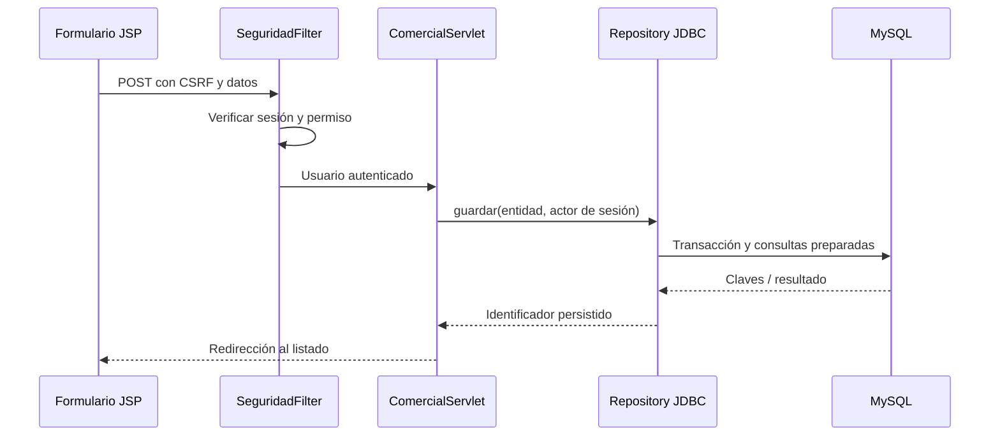

# Análisis del código por bloques: etapa 5

## Bloque 1. Contrato y entidades

Paquete: `com.mycompany.novatech.app.comercial`.

`Repository<T>` declara `listar(busqueda)`, `buscar(id)`, `guardar(entidad, actor)` y `eliminar(id)`. Sus especializaciones son `ClienteRepository`, `ProveedorRepository` y `ProductoRepository`. El controlador conserva referencias a estos contratos; las clases JDBC implementan el acceso a MySQL. `ProveedorRepository` añade una operación para importar un lote completo.

`Tercero` contiene los datos compartidos de una ficha comercial. `Cliente` y `Proveedor` dan tipos distintos a cada contrato; sus reglas se validan antes de persistir. `Producto` es inmutable y utiliza BigDecimal para evitar errores de redondeo binario en precios. `Validacion` centraliza texto, identificadores, números y contactos.

## Bloque 2. Repository para clientes

`JdbcClienteRepository` especializa `JdbcTerceroRepository<Cliente>` y fija la tabla clientes desde el código. El nombre de tabla nunca se obtiene del formulario.

- `listar` usa una búsqueda parametrizada y une la ficha comercial con `datos_personales`.
- `buscar` consulta una clave concreta y devuelve null si desapareció.
- `guardar(Connection, ...)` valida la entidad, bloquea la ficha editada, comprueba el distrito y resuelve la identidad personal. Para DNI busca una persona existente; si corresponde a un usuario, evita duplicarla y protege sus nombres frente a cambios comerciales. Para RUC mantiene una ficha del contacto y guarda la razón social en clientes.
- `guardar(entidad, actor)` abre una transacción, ejecuta las operaciones de persona y cliente, y confirma únicamente si todas funcionan. Ante error ejecuta rollback.
- `eliminar` borra el cliente y solo elimina su persona si quedó sin usuario ni relaciones comerciales. Una futura FK desde ventas impedirá eliminar clientes con ventas.

**Segundo patrón: Prototype.** `Cliente.copiarParaNuevo()` crea una ficha independiente reutilizando dirección, distrito y teléfono. No copia ID, persona, DNI/RUC, nombre ni creador. La acción visible «Nuevo con este domicilio» usa esta operación; el usuario completa la identidad y confirma el alta. Es una copia parcial deliberada de los datos reutilizables, no una duplicación del cliente original.

## Bloque 3. Repository para proveedores

`JdbcProveedorRepository` reutiliza la transacción común con una tabla fija diferente. La entidad guarda RUC, razón social, contacto principal y ubicación. MySQL rechaza un RUC repetido. Un proveedor utilizado por productos no puede eliminarse: la FK protege la relación.

`importar` mantiene una sola conexión y transacción para todas las filas. Primero el adaptador valida el lote; después el repositorio inserta las entidades. Incluso si la última fila choca con un RUC existente en MySQL, se revierten las altas previas del lote y sus personas.

**Segundo patrón: Adapter.** `ProveedorTsvAdapter` adapta datos tabulares copiados de una hoja de cálculo al modelo `Proveedor` que consume el repositorio. La interfaz externa es una cadena TSV; la interna es `List<Proveedor>`. Comprueba columnas, cantidad de filas, documentos repetidos y formato de cada entidad. No se presenta como una integración con una API externa ni como un lector de archivos `.xlsx`.

## Bloque 4. Repository para productos

`JdbcProductoRepository` convierte filas en `Producto`, ejecuta búsquedas preparadas y guarda los campos comerciales. Al editar bloquea la fila con `FOR UPDATE` y comprueba las relaciones nuevas contra catálogos/proveedor activos. Inserta el creador solo en altas. La baja exige stock cero y respeta las restricciones referenciales.

`CatalogoComercialRepository` ofrece el CRUD de categorías, marcas y unidades. Usa una lista cerrada de tablas, parámetros para los valores y las FK de productos para impedir eliminaciones que dejen referencias huérfanas. Su consulta de distritos compone la ruta territorial sin guardar nombres duplicados.

**Segundo patrón: Builder.** `Producto.Builder` reúne identidad, clasificación, descripción, valores y estado. `build()` construye una entidad inmutable únicamente si todas las reglas se cumplen. El servlet y el lector JDBC utilizan ese mismo proceso; no hay un camino de guardado desde el formulario que omita sus validaciones.

## Bloque 5. Controlador, vista y autorización

`ComercialServlet` recibe las rutas de los cuatro formularios comerciales. GET prepara entidades y catálogos; POST toma la acción y los campos, obtiene el actor de `request.getAttribute("actual")` y llama al contrato correspondiente. Tras éxito redirige a GET para evitar repetir el alta al recargar. Los errores de validación conservan los campos del formulario; los errores de conexión no muestran SQL ni credenciales.

Las vistas `terceros.jsp`, `productos.jsp` y `catalogos-productos.jsp` se incluyen desde la plantilla `pagina.jsp`. Solo muestran datos y formularios; no contienen consultas SQL. Se escapan valores mediante los helpers existentes.

El selector de proveedor carga las 500 fichas recientes mediante `listar`. Si el proveedor seleccionado no aparece en ellas, el controlador lo recupera con `buscar` y lo añade a las opciones. Así, editar un artículo o devolver un error de validación no borra indirectamente su relación con un proveedor antiguo. El guardado mantiene las comprobaciones de relaciones activas del repositorio.

`SeguridadFilter` exige sesión, CSRF para POST y el permiso específico del módulo. `MenuMediator` y `AbrirModuloCommand` muestran y abren únicamente las opciones permitidas. Ocultar el enlace no sustituye la comprobación del servidor. La asignación/revocación sigue usando los permisos de la base en cada petición.

## Cómo sustentarlo

Mostrar primero una alta real y luego recorrer el contrato, la implementación JDBC, la transacción y la JSP. Para cada módulo demostrar el segundo patrón con su acción concreta. Finalmente provocar un documento/código repetido o un stock negativo y explicar por qué se rechaza sin dejar registros parciales.

El análisis corresponde a MySQL y al código implementado. No afirma haber aplicado todas las alternativas de patrones enumeradas en el Excel.
